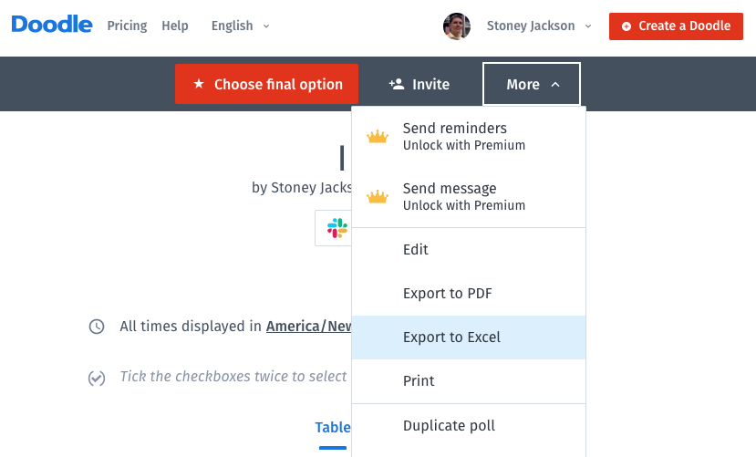
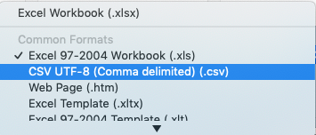

# POSSE IRC Meeting Finder

Finds a sets of meetings such that each participant in a Doodle Poll can attend
at least one.

## Requirements

* Python 3.6+

## Using

1. Download Excel file from Doodle Poll.

    

2. Use Excel to save it as a CSV file.

    

3. Edit CSV and prefix facilitators' names with `*`.
    ```CSV
    *Stoney Jackson,,,,,,OK,OK,OK,OK,OK,,,,,,,OK,OK,OK,OK,,,,OK,,,,,,,OK,OK,OK,OK,OK,OK,OK,,,,,,,,OK,OK,OK,OK,OK,OK,OK,OK,,,,,,,OK,OK,OK,OK,OK,OK,OK,,,,,,,,(OK),(OK),(OK),(OK),(OK),(OK),(OK),(OK),,,,
    ```

4. In the root of this project, run `find_meetings.py` with `--dry-run` to experiment with filters.

    ```bash
    $ python3 find_meetings.py path/to/Doodle.csv 3 \
        --ignore-if-need-be \
        --weekday \
        --min-people=4 \
        --max-people=8 \
        --min-participants=3 \
        --max-participants=6 \
        --min-facilitators=1 \
        --min-start=9 \
        --max-start=15 \
        --max-facilitations=2 \
        --dry-run
    APPLYING MEETING FILTERS
    WeekdayFilter:  in=84, filtered=14, out=70
    MinStartFilter(9):  in=70, filtered=10, out=60
    MaxStartFilter(15):  in=60, filtered=25, out=35
    MinPeopleFilter(4):  in=35, filtered=2, out=33
    MaxPeopleFilter(8):  in=33, filtered=3, out=30
    MinFacilitatorsFilter(2):  in=30, filtered=10, out=20
    MinParticipantsFilter(3):  in=20, filtered=2, out=18
    MaxParticipantsFilter(6):  in=18, filtered=0, out=18
    There are 816 3-meeting candidates
    $
    ```

5. When satisfied, run `find_meetings.py` without `--dry-run`

    ```bash
    $ python3 find_meetings.py path/to/Doodle.csv 3 \
        --ignore-if-need-be \
        --weekday \
        --min-people=4 \
        --max-people=8 \
        --min-participants=3 \
        --max-participants=6 \
        --min-facilitators=1 \
        --min-start=9 \
        --max-start=15 \
        --max-facilitations=2 \
        --dry-run
        APPLYING MEETING FILTERS
        WeekdayFilter:  in=84, filtered=14, out=70
        MinStartFilter(9):  in=70, filtered=10, out=60
        MaxStartFilter(15):  in=60, filtered=25, out=35
        MinPeopleFilter(4):  in=35, filtered=2, out=33
        MaxPeopleFilter(8):  in=33, filtered=3, out=30
        MinFacilitatorsFilter(1):  in=30, filtered=3, out=27
        MinParticipantsFilter(3):  in=27, filtered=2, out=25
        MaxParticipantsFilter(6):  in=25, filtered=0, out=25
        There are 2300 3-meeting candidates
        APPLYING CANDIDATE FILTERS
        AllParticipantsCanAttendAtLeastOneMeetingFilter:  in=2300, filtered=2298, out=2
        MaxFacilitationsFilter(min_facilitators=1, max_facilitations=2):  in=2, filtered=0, out=2
        ========= Solution 1 =============

        Mon May 20 12:00:00 2019
            *Stoney Jackson

            ...

        Wed May 22 09:00:00 2019
            *Stoney Jackson

            ...

        Fri May 24 14:00:00 2019
            *Stoney Jackson

            ...

        ========= Solution 2 =============

        ...

    $
    ```


## Getting help

```bash
$ python3 find_meetings.py --help
```

## Running Unit Tests

In the root of the project...

```bash
$ python3 -m unittest discover
```
